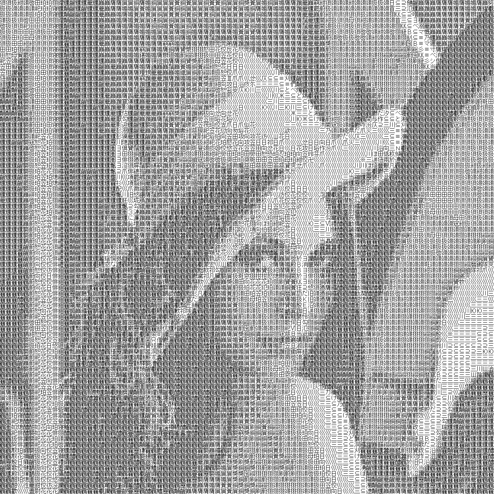
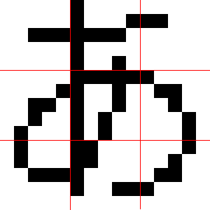

# png2aa

[](./LICENSE)
[](https://github.com/ohmae/png2aa/releases)
[](https://github.com/ohmae/png2aa/issues)
[](https://github.com/ohmae/png2aa/issues)

## What's this

ベクトル量子化を使って、png画像をテキストで表現します。
等幅全角文字だけを敷き詰める方式のため、アスキーアートとはちょっと違います。

この画像を変換すると


このように出力します。



### ベクトル量子化

画像を文字を敷き詰めたものへ変換することを単純にやろうとすると、
一つの文字のなかの線と余白部分を平均化して、1ドットを1文字で置き換えることになると思います。

「あ」という文字で言うと


平均化するとこうなります。


ただ、ここまで平均化してしまうと情報量が少なくなりすぎですよね。
文字というのは線が集中している箇所とそうでない箇所があり。濃度に偏りがあります。
そこで、以下のように一文字を9分割して、平均化します。



「あ」だとこのようになります。


これを全部の文字に対して行います。
9個の値からできていますので、文字の濃度分布の特徴を9次元ベクトルで表していると言うことになります。

そして、画像を同様に3x3のエリアに区切り、9次元ベクトルを作ります。
この9次元ベクトル同士を比較して、最も近いベクトルを持つ文字に置換していきます。
これがベクトル量子化です。

1文字で9ドットを完全でないにしても表現しているので、使用している文字数よりも解像感の高い画像が得られます。

### 制約

一発ネタで作ったので汎用性はありません。
フォントもMSゴシック固定でべた書きにしています。
入力画像もPNG限定です。
サイズも固定で、ビットマップフォントがあることを前提としています。

ベクトル量子化を行うに当たって、単純に総当たりで検索しているので非常に重いです。
しかもシングルスレッドで実行するのですごく効率が悪いです。

## Usage

```
$ mkdir work
$ cd work
$ cmake /path/to/repository
$ make
```

```
$ cp /path/to/msgothic.ttc ./
$ make_code_book > code_book.txt
$ png2txt -c code_book.txt -i input.png > aa.txt
$ txt2png -i aa.txt -o output.png
```

- make_code_book でフォントから9次元ベクトルを作成しコードブックを作成します。
まれにベクトルデータが一致する文字があります。
その場合は文字を連続して書き出しています。利用する際は先頭の文字が利用されます。
■のような文字も含まれています。
これが入っていると、ある程度黒いところが全部これで置換されてしまうため、ベタ領域のある文字は手編集で取り除いた方がよいと思います。
- png2txt はpngデータを上記コマンドで作成したコードブックを利用してテキストデータに変換します。
- txt2png は上記コマンドで出力したテキストファイルを入力として、文字で表現された画像をpngとして出力します。

## Dependent library

- libpng
- freetype

## Author

大前 良介 (OHMAE Ryosuke)
http://www.mm2d.net/

## License

[MIT License](./LICENSE)
